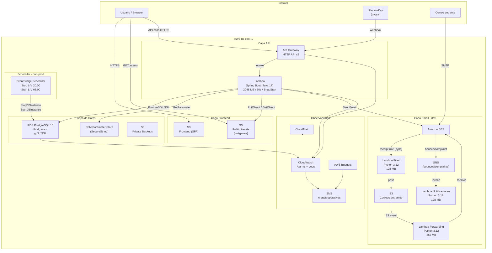
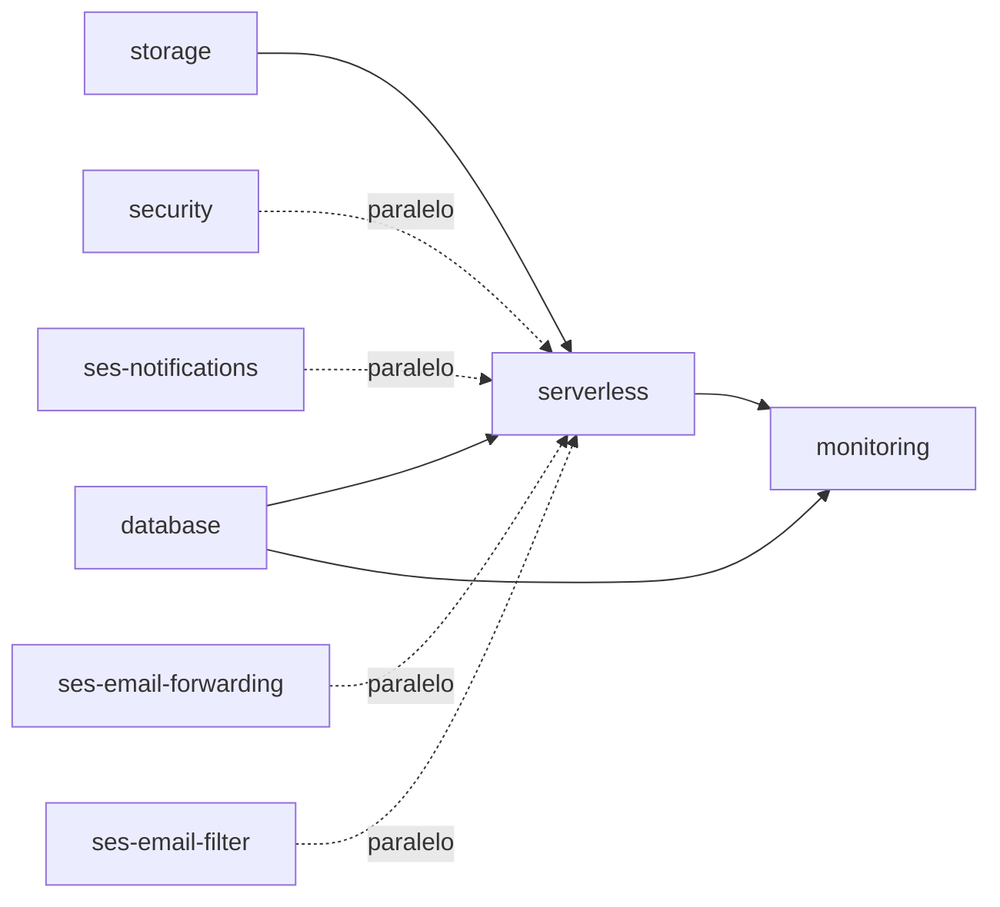
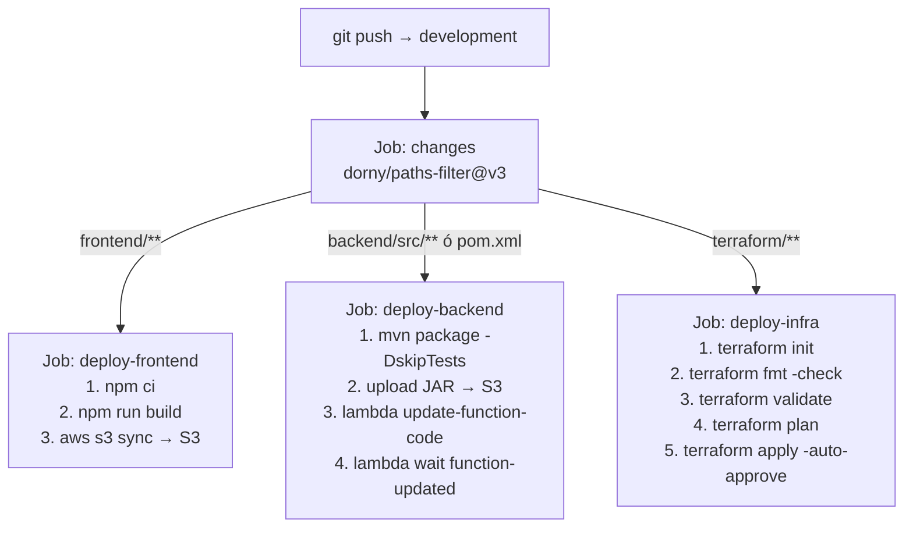

# Arquitectura de Infraestructura — Paso Centurion Tours

> Toda la infraestructura es gestionada con **Terraform** y desplegada en **AWS us-east-1**.
> El estado de Terraform se almacena en S3 con bloqueo via DynamoDB, un backend independiente por ambiente.

---

## Índice

1. [Vista general](#1-vista-general)
2. [Diagrama de arquitectura](#2-diagrama-de-arquitectura)
3. [Ambientes](#3-ambientes)
4. [Servicios AWS](#4-servicios-aws)
5. [Estructura de módulos Terraform](#5-estructura-de-módulos-terraform)
6. [Flujo de datos](#6-flujo-de-datos)
7. [Seguridad](#7-seguridad)
8. [CI/CD](#8-cicd)
9. [Optimización de costos](#9-optimización-de-costos)

---

## 1. Vista general

La arquitectura sigue un modelo **serverless + managed services** sin servidores propios:

- El **frontend** es una SPA (React/Vite) servida directamente desde S3 como sitio estático.
- El **backend** es un servicio Spring Boot empaquetado como **AWS Lambda** (Java 17), expuesto a través de **API Gateway HTTP API**.
- La **base de datos** es **RDS PostgreSQL** en la VPC por defecto de AWS, accesible por la Lambda vía internet público con SSL.
- El **correo electrónico** entrante y saliente es gestionado por **Amazon SES** con Lambdas auxiliares para filtrado, reenvío y notificaciones de rebotes.
- La **observabilidad** está cubierta con CloudWatch (alarms + logs), CloudTrail, SNS y Budgets.

---

## 2. Diagrama de arquitectura



---

## 3. Ambientes

Hay tres ambientes completamente independientes, cada uno con su propio estado de Terraform y sus propios recursos en AWS.

| Característica | `dev` | `staging` | `prod` |
|---|---|---|---|
| **Backend state** | S3 + DynamoDB dedicados | S3 + DynamoDB dedicados | S3 + DynamoDB dedicados |
| **Dominio** | `dev.pasocenturion.com.uy` | Configurable | Configurable |
| **PlacetoPay** | Modo simple (UAT) | Modo avanzado (UAT) | Modo avanzado (producción) |
| **SES (filtro, reenvío, notificaciones)** | Habilitado | No | No |
| **RDS Multi-AZ** | No | No | Sí |
| **RDS Performance Insights** | No | No | Sí |
| **RDS Enhanced Monitoring** | No | No | Sí (60s) |
| **RDS backup retention** | 1 día | 7 días | 7 días |
| **RDS deletion protection** | No | No | Sí |
| **RDS auto-stop/start** | Sí (L-V 08-20hs) | Sí (L-V 08-20hs) | No |
| **GuardDuty** | No | No | Opcional (flag) |
| **AWS Config** | No | No | Opcional (flag) |
| **Lambda reserved concurrency** | Sin límite | Sin límite | 10 |
| **Lambda SnapStart** | Sí | Sí | Sí |
| **Budget mensual (USD)** | 15 | 40 | 100 |
| **Lambda usage budget** | No | No | Sí (1M req/mes) |
| **Log retention API Gateway** | 7 días | 7 días | 30 días |
| **CloudFront logs lifecycle** | 30 días | 30 días | 90 días |

---

## 4. Servicios AWS

### Lambda (Compute)

| Función | Runtime | Memoria | Timeout | Trigger |
|---|---|---|---|---|
| **Backend API** | Java 17 | 2048 MB | 60 s | API Gateway |
| **SES Filter** | Python 3.12 | 128 MB | 10 s | SES Receipt Rule (sync) |
| **Email Forwarding** | Python 3.12 | 256 MB | 30 s | S3 Event Notification |
| **SES Notifications** | Python 3.12 | 128 MB | 30 s | SNS |

La Lambda del backend usa **SnapStart** con versiones publicadas para reducir el cold start en producción. No está en ninguna VPC (sin costo de ENI) y se conecta al RDS vía internet público con SSL.

### API Gateway (HTTP API v2)

- Protocolo HTTP, **payload format 2.0**
- Stage único (`$default`) con auto-deploy
- Integración `AWS_PROXY` con la Lambda del backend
- CORS habilitado (permisivo en dev, configurable por ambiente)
- Access logs a CloudWatch en formato JSON
- Rutas definidas explícitamente: `health`, `auth`, `senderos`, `reservas`, `pagos`, `images`, `alojamientos`, `checkout` y más

### RDS PostgreSQL

- Motor: PostgreSQL 15.12
- Instancia: `db.t4g.micro` (ARM Graviton2)
- Storage: gp3, 10 GB inicial, autoscaling hasta 30 GB
- Cifrado en reposo habilitado
- Desplegado en la **VPC por defecto** de AWS (sin costo de VPC)
- Acceso público habilitado (requiere SSL)
- Parámetro `log_statement = all` para auditoría de queries
- Password almacenada en SSM como SecureString

### S3

| Bucket | Acceso | Versioning | Propósito |
|---|---|---|---|
| `tinambu-frontend-{env}` | Público (lectura) | Habilitado | Hosting SPA |
| `tinambu-public-assets-{env}` | Público (lectura) | No | Imágenes, JAR de Lambda |
| `tinambu-private-backups-{env}` | Privado | Habilitado | Backups privados |
| `tinambu-cloudfront-logs-{env}` | Privado | No | Logs de CloudFront |
| `tinambu-cloudtrail-{env}` | Privado (solo CloudTrail) | No | Logs de auditoría |

### Amazon SES (solo dev activo vía Terraform)

- **Receipt Rule Set activo** con reglas en orden:
  1. Filtro Lambda (sincrónico, `scan_enabled = true`) — bloquea spam/phishing
  2. Reglas S3 por dirección (info, consulta, consultas, reservas)
- **IP Receipt Filters** — bloqueo a nivel de cuenta (configurable vía variable)
- **Blocklist** de remitentes gestionada en SSM (editable sin re-deploy)
- Notificaciones de bounces y complaints a SNS

### CloudWatch

- **11 alarmas** por ambiente para: errores 5xx de API Gateway, latencia de API Gateway, errores Lambda, duración Lambda, throttles Lambda, CPU de RDS, storage libre de RDS, conexiones RDS, y alarmas específicas de pagos (webhook errors, status errors, latencia pagos)
- Log groups con retención configurada por ambiente
- Todas las alarmas notifican a un topic SNS de alertas

### EventBridge Scheduler (non-prod)

- **Stop RDS:** L-V a las 20:00 hs hora de Montevideo
- **Start RDS:** L-V a las 08:00 hs hora de Montevideo
- Fines de semana: RDS permanece apagado
- IAM Role con permisos mínimos (solo `StopDBInstance`/`StartDBInstance` sobre el ARN específico)

### SSM Parameter Store

Todos los parámetros usan SecureString (KMS). Gestionados bajo el path `/{environment}/`:

| Path | Contenido |
|---|---|
| `/{env}/database/password` | Password del RDS (random, generado por Terraform) |
| `/{env}/app/jwt_secret` | Secret JWT (random, generado por Terraform) |
| `/{env}/payment/placetopay/login` | Login de PlacetoPay (valor manual post-deploy) |
| `/{env}/payment/placetopay/secret_key` | Secret key de PlacetoPay (valor manual post-deploy) |
| `/{env}/app/environment` | Nombre del ambiente |
| `/{env}/app/log_level` | Nivel de log de la aplicación |
| `/{env}/ses/filter/blocklist` | Lista de remitentes bloqueados (gestionable sin re-deploy) |

### AWS Budgets

- **Cost budget:** Alerta al 80%, 100% del gasto real y 100% del gasto proyectado. Umbrales: $15 dev / $40 staging / $100 prod
- **Lambda usage budget** (solo prod): Alerta cuando se proyectan más de 1 millón de invocaciones mensuales

---

## 5. Estructura de módulos Terraform

```
terraform/
├── shared/
│   ├── versions.tf          # Versiones del provider (AWS ~> 5.0, Terraform >= 1.5)
│   └── backend.tf           # Plantilla de backend S3
│
├── environments/
│   ├── dev/                 # Backend, provider, instanciación de módulos + SES
│   ├── staging/             # Backend, provider, instanciación de módulos core
│   └── prod/                # Backend, provider, instanciación de módulos core
│
└── modules/
    ├── storage/             # S3 buckets (frontend, assets, backups, cloudfront logs)
    ├── database/            # RDS PostgreSQL + SSM password + EventBridge scheduler
    ├── serverless/          # Lambda API + API Gateway HTTP API
    ├── security/            # CloudTrail + SSM params app + GuardDuty/Config (prod)
    ├── monitoring/          # CloudWatch alarms + SNS + Budgets
    ├── networking/          # VPC, NAT, endpoints (módulo disponible, no activo en envs)
    ├── ses-notifications/   # SNS + Lambda bounce/complaint handler
    ├── ses-email-forwarding/# Lambda S3-triggered para reenvío de correo
    └── ses-email-filter/    # Lambda sincrónica + receipt rules + IP filters
```

### Dependencias entre módulos



El módulo `networking` existe pero **no es instanciado** por ningún ambiente actualmente. Se optó por usar la VPC por defecto de AWS para reducir costos.

---

## 6. Flujo de datos

### Solicitud de usuario (API)

```
Browser → API Gateway (HTTPS)
       → Lambda Java/Spring Boot
           ├── SSM: obtiene password de DB y JWT secret
           ├── RDS PostgreSQL: consulta/escribe datos
           ├── S3 public-assets: lee/escribe imágenes
           └── SES: envía emails transaccionales
       → Respuesta JSON al browser
```

### Pago con PlacetoPay

```
Browser → API Gateway POST /pagos/links
       → Lambda crea link en PlacetoPay (UAT o producción según ambiente)
       → PlacetoPay notifica resultado vía webhook
       → API Gateway POST /pagos/links/webhook → Lambda actualiza estado en RDS
```

### Correo entrante (dev)

```
Email externo → SES
             → Lambda Filter (sync, verifica blocklist SSM + escaneo)
             → Regla S3: guarda en bucket de correos entrantes (prefix por dirección)
             → S3 Event → Lambda Forwarding → SES envía reenvío al destino configurado

SES bounce/complaint → SNS → Lambda Notifications → registra/alerta
```

### Deploy de la aplicación

```
git push → development branch
         → GitHub Actions detecta cambios con paths-filter
         ├── frontend/** → build Vite → aws s3 sync → S3
         ├── backend/**  → mvn package → upload JAR a S3 → lambda update-function-code
         └── terraform/**→ terraform init/fmt/validate/plan/apply → AWS
```

---

## 7. Seguridad

### Cifrado
- **En tránsito:** HTTPS en API Gateway, SSL requerido en RDS, TLS en SES
- **En reposo:** SSE-S3 en todos los buckets, cifrado en RDS (`storage_encrypted = true`), SecureString en SSM

### Gestión de secretos
- Ninguna credencial ni password está hardcodeada en el código Terraform
- Passwords generadas aleatoriamente con `random_password` de Terraform
- Credenciales de terceros (PlacetoPay) se ingresan manualmente post-deploy; Terraform ignora cambios posteriores con `lifecycle { ignore_changes = [value] }`
- La Lambda accede solo a los paths SSM que necesita (mínimo privilegio)

### IAM
- Cada Lambda tiene su propio rol de ejecución con permisos mínimos
- El EventBridge Scheduler tiene un rol con permisos solo de `StopDBInstance`/`StartDBInstance` sobre el ARN exacto del RDS
- No se usan credenciales de largo plazo en la aplicación (solo rol de Lambda)

### Auditoría
- **CloudTrail** registra todos los eventos de gestión (read y write) en un bucket S3 dedicado
- **GuardDuty** disponible en prod (deshabilitado por defecto, activable con variable)
- **AWS Config** disponible en prod (deshabilitado por defecto, activable con variable)

### Red
- La Lambda no está en VPC (sin ENI, sin costos asociados)
- El RDS es accesible públicamente pero protegido por Security Group y SSL
- Los IP Receipt Filters de SES bloquean rangos de IPs maliciosos a nivel de cuenta

---

## 8. CI/CD

El pipeline está implementado en GitHub Actions (`.github/workflows/deploy-dev.yml`) y corre sobre la rama `development`.



- Los tres jobs corren **en paralelo** entre sí (solo dependen del job `changes`)
- Los secrets `AWS_ACCESS_KEY_ID` y `AWS_SECRET_ACCESS_KEY` están configurados en GitHub
- `workflow_dispatch` permite disparar todos los jobs manualmente desde la UI de GitHub

---

## 9. Optimización de costos

| Decisión | Impacto |
|---|---|
| Lambda sin VPC | Elimina costo de ENI (~$7/mes) y NAT Gateway |
| VPC por defecto para RDS | Elimina el costo del módulo networking (VPC custom, NAT instance) |
| `db.t4g.micro` con gp3 | Instancia ARM de menor costo disponible en RDS |
| EventBridge Scheduler stop/start RDS | Reduce horas de cómputo de 730 → ~260 hs/mes en dev/staging (~58% menos) |
| GuardDuty / Config / WAF deshabilitados por defecto | Solo se activan en prod cuando realmente se necesitan |
| Interface VPC Endpoints deshabilitados | Cada endpoint cuesta ~$22/mes; no son necesarios sin VPC custom |
| SnapStart en Lambda | Evita Provisioned Concurrency (~$15+/mes para mantener instancias calientes) |
| Log retention corta en non-prod | 7 días en dev vs 30 días en prod (reduce ingesta y almacenamiento en CloudWatch) |
| CloudFront log lifecycle corta en non-prod | 30 días dev vs 90 días prod |
| Performance Insights / Enhanced Monitoring solo en prod | Elimina costo de monitoreo avanzado en ambientes de desarrollo |
| Budgets con alertas | Notificación temprana antes de sobrepasar el límite mensual |

### Estimación de costos dev (con scheduler activo)

| Servicio | Costo estimado/mes |
|---|---|
| RDS db.t4g.micro (~260 hs/mes) | ~$4.16 |
| RDS storage 10 GB gp3 | ~$1.15 |
| CloudWatch (11 alarmas + logs) | ~$2.50 |
| S3 (5 buckets) | ~$1.50 |
| CloudTrail | ~$1.00 |
| Lambda + API Gateway | ~$0.50 |
| Misc (SNS, SSM, Budgets) | ~$1.00 |
| **Total estimado** | **~$11.81/mes** |
