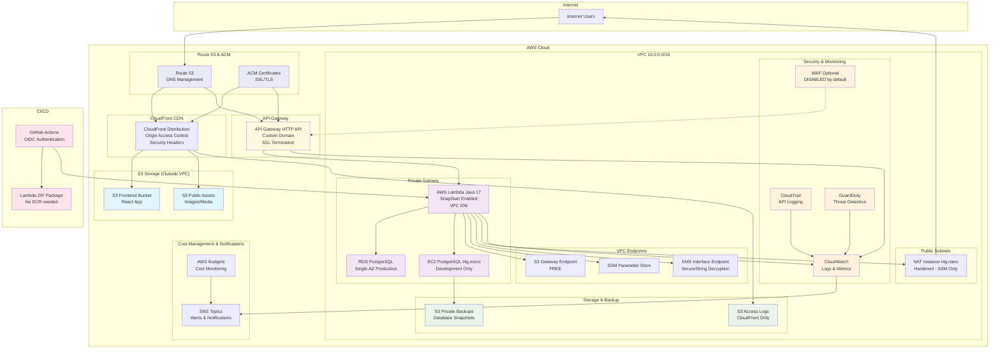

# Infrastructure Implementation Plan – Tinambú Paso Centurión Tours

## Objective
Design and implement a complete AWS infrastructure using Terraform and MCP (Model Context Protocol) for the Tinambú Tours application, supporting development, staging, and production environments with scalable, secure, and maintainable architecture.

## 🏗️ Architecture Overview

### **Serverless Architecture Diagram**



### **Architecture Legend**
- 🔵 **Blue (Public)**: Resources accessible from internet (S3 frontend/assets)
- 🟣 **Purple (Private)**: Internal resources (Lambda, databases) 
- 🟡 **Orange (Security)**: Security and monitoring services
- 🟢 **Green (Storage)**: Backup and logging storage
- 🔴 **Pink (CI/CD)**: Deployment and Lambda packaging
- 🟨 **Yellow (Serverless)**: API Gateway serverless compute
- 🟦 **Light Blue (DNS)**: Route 53 and certificate management

### **Key Serverless Architecture Benefits**
- ✅ **Cost Optimized**: NAT Instance t4g.nano (vs NAT Gateway), Single-AZ RDS, pay-per-use Lambda
- ✅ **Serverless**: API Gateway + Lambda, no server management
- ✅ **Secure**: Private subnets, OAC, Block Public Access, encryption, security headers
- ✅ **Scalable**: Auto-scaling Lambda, Multi-AZ RDS upgrade path documented  
- ✅ **Observable**: CloudWatch logs/metrics, access logs, AWS Budgets monitoring
- ✅ **Automated**: OIDC CI/CD, ZIP packaging, CloudFront invalidation

### **Serverless Infrastructure Components**
- **Compute**: AWS Lambda functions with API Gateway HTTP API
- **Database**: RDS PostgreSQL (Single-AZ) for production, PostgreSQL on EC2 for development
- **Storage**: S3 buckets with CloudFront CDN and Origin Access Control
- **CDN**: CloudFront with security headers and custom domain
- **API Management**: API Gateway HTTP API with custom domain and SSL
- **DNS & SSL**: Route 53 for domain management, ACM for certificates
- **Networking**: VPC + NAT Instance (sin NAT Gateway) + S3 Gateway Endpoint (SSM/KMS Interface opcionales)
- **Security**: IAM roles, Security Groups, optional WAF (disabled), CloudTrail, GuardDuty
- **Monitoring**: CloudWatch logs/metrics, AWS Budgets for cost monitoring
- **Secrets**: AWS Systems Manager Parameter Store (SSM)
- **CI/CD**: GitHub Actions with OIDC, Lambda ZIP packaging

### **Environment Strategy**
```
├── dev/        # Development environment
├── staging/    # Pre-production testing
└── prod/       # Production environment
```

## Current State Analysis
- ✅ **Application**: Backend and frontend containerized with Docker
- ✅ **Repository**: GitHub repository with organized structure
- ❌ **Missing**: Complete AWS infrastructure, Terraform modules, CI/CD pipelines
- ❌ **Missing**: Multi-environment configuration, monitoring, security setup

## Implementation Phases

### Phase 1: Foundation Infrastructure

#### Step 1.1: Terraform Project Structure
- **Directory**: `terraform/`
```
terraform/
├── environments/
│   ├── dev/
│   │   ├── main.tf
│   │   ├── variables.tf
│   │   └── terraform.tfvars
│   ├── staging/
│   └── prod/
├── modules/
│   ├── networking/
│   ├── database/
│   ├── storage/
│   ├── compute/
│   ├── monitoring/
│   └── security/
├── shared/
│   ├── backend.tf
│   └── versions.tf
└── scripts/
    ├── deploy.sh
    └── destroy.sh
```

#### Step 1.2: AWS Provider and Backend Configuration
- **File**: `terraform/shared/backend.tf`
- **Configuration**: S3 backend for Terraform state
- **Features**: State locking with DynamoDB, versioning, encryption

#### Step 1.3: Networking Module
- **File**: `terraform/modules/networking/main.tf`
- **Components**:
  - VPC with CIDR block configuration (10.0.0.0/16)
  - Public subnets (2 AZs) for NAT Instance and external access
  - Private subnets (2 AZs) for Lambda and RDS
  - Internet Gateway for public subnet access
  - **NAT Instance t4g.nano** in public subnet (cost-effective egress):
    - **Hardened security**: No SSH, SSM Session Manager only
    - **Security Group**: 
      - Ingress: desde CIDRs de subredes privadas (TCP 0–65535) para forwarding
      - Egress: 443 (HTTPS) a 0.0.0.0/0
      - Sin SSH (gestión por SSM Session Manager)
    - **Auto-recovery enabled** for high availability
    - **Default route** (0.0.0.0/0) from private subnets to NAT Instance
  - Route tables for public/private subnets
  - **VPC Endpoints** for serverless cost optimization:
    - **S3 Gateway Endpoint** (free) - Lambda to S3 access
    - **(Optional) SSM Interface Endpoint** - Parameter Store access
    - **(Optional) KMS Interface Endpoint** - SecureString decryption from Lambda
  - **Security groups**:
    - Lambda security group (outbound to RDS, VPC endpoints, NAT Instance)
    - RDS security group (inbound from Lambda SG only)
    - NAT Instance security group:
      - Ingress: desde CIDRs de subredes privadas (TCP 0–65535) para forwarding
      - Egress: 443 (HTTPS) a 0.0.0.0/0
      - Sin SSH (gestión por SSM Session Manager)
    - VPC Endpoint security groups

### Phase 2: Storage and Database

#### Step 2.1: S3 Storage Module
- **File**: `terraform/modules/storage/main.tf`
- **Buckets**:
  - `tinambu-frontend-{env}` - Frontend static files (React app)
  - `tinambu-public-assets-{env}` - Public images and media
  - `tinambu-private-backups-{env}` - Database backups (private)
  - `tinambu-logs-{env}` - CloudFront access logs
- **Security Features**:
  - **S3 Block Public Access** enabled on all buckets
  - Server-side encryption (SSE-S3) on all buckets
  - Versioning enabled on frontend and backups buckets
  - **Origin Access Control (OAC)** for CloudFront access
  - Lifecycle policies for log retention and cost optimization

#### Step 2.2: Database Module
- **File**: `terraform/modules/database/main.tf`
- **Production (RDS PostgreSQL)**:
  - PostgreSQL 15 engine
  - **Single-AZ deployment** by default (cost optimization)
  - Automated backups with 7-day retention
  - **Encryption at rest** enabled
  - DB subnet group in private subnets
  - Parameter group for performance optimization
  - Security group with restricted access from Lambda SG only
- **Development (EC2 PostgreSQL)**:
  - PostgreSQL on **EC2 t4g.micro** (ARM-based) in private subnet
  - Simple backups to S3 using pg_dump
  - Security group with restricted access from Lambda dev SG only
  - SSM Session Manager for maintenance (no SSH)

**📈 Multi-AZ Upgrade Path:**
When your application grows and requires higher availability, enable Multi-AZ:

```hcl
# terraform/modules/database/main.tf
resource "aws_db_instance" "main" {
  # Current configuration (Single-AZ)
  multi_az = var.environment == "prod" && var.enable_high_availability
  
  # To enable Multi-AZ later:
  # 1. Set enable_high_availability = true in prod environment
  # 2. Apply terraform - RDS will automatically handle the migration
  # 3. Expect ~15-30 minutes downtime during the upgrade
  # 4. Cost will approximately double for the database
}
```

**When to upgrade to Multi-AZ:**
- Traffic > 1000 concurrent users
- Business requires < 5 minutes downtime SLA
- Revenue impact of database downtime > $200/hour

#### Step 2.3: CloudFront CDN Module
- **File**: `terraform/modules/storage/cloudfront.tf`
- **Configuration**:
  - **Primary Origin**: S3 bucket for frontend (React app)
  - **Secondary Origin**: S3 bucket for public assets (images/media)
  - **Origin Access Control (OAC)** - replaces Legacy OAI
  - Cache behaviors optimized for static content
  - **Custom domain** with Route 53 and ACM certificate
  - **Security Headers Policy for PlacetoPay Integration**:
    - HSTS (Strict-Transport-Security): max-age=31536000; includeSubDomains
    - X-Content-Type-Options: nosniff
    - X-Frame-Options: DENY
    - Referrer-Policy: strict-origin-when-cross-origin
    - **CSP for PlacetoPay**: 
      ```
      Content-Security-Policy: 
        default-src 'self'; 
        script-src 'self' checkout.placetopay.com checkout-test.placetopay.com; 
        frame-src 'self' checkout.placetopay.com checkout-test.placetopay.com; 
        connect-src 'self' checkout.placetopay.com checkout-test.placetopay.com;
        img-src 'self' data: checkout.placetopay.com checkout-test.placetopay.com;
        style-src 'self' checkout.placetopay.com checkout-test.placetopay.com
      ```
  - **Access logging** to S3 bucket
  - Compression enabled for better performance

### Phase 3: Serverless Compute Infrastructure

#### Step 3.1: API Gateway Module
- **File**: `terraform/modules/serverless/api_gateway.tf`
- **Configuration**:
  - **API Gateway HTTP API** (cheaper than REST API)
  - Custom domain name with ACM certificate
  - **TLS 1.2+ enforcement** for security compliance
  - CORS configuration for frontend
  - **PlacetoPay Payment Links Routes**:
    - `POST /pagos/links/webhook` - Payment notifications from PlacetoPay
    - `GET /pagos/links/estado?reference=...` - Query payment status
    - `POST /pagos/links/crear` - Create payment link (Advanced integration only)
  - **Optional WAF integration** (disabled by default):
    ```hcl
    enable_waf = var.environment == "prod" && var.enable_waf
    ```
  - **Access logging to CloudWatch** (optional S3 export via Firehose)
  - Throttling and rate limiting

#### Step 3.2: Lambda Functions Module
- **File**: `terraform/modules/serverless/lambda.tf`
- **Configuration**:
  - Lambda functions for backend API endpoints
  - **Runtime**: Java 17 (NO Node.js - backend is Java only)
  - **Lambda SnapStart enabled** for improved cold start performance
  - **ZIP packaging** (not container images)
  - **VPC configuration** with ENI in private subnets
  - Environment variables from SSM Parameter Store
  - **Memory**: 1024MB-2048MB (Java requires more memory)
  - **Timeout**: 30 seconds for API calls
  - Dead letter queue for failed invocations
  - Reserved concurrency for production

#### Step 3.3: Lambda VPC Access
- **File**: `terraform/modules/serverless/vpc_access.tf`
- **Configuration**:
  - Lambda ENI in private subnets
  - Security group allowing outbound to RDS (port 5432)
  - Security group allowing outbound to VPC endpoints (HTTPS)
  - **No public IP assignment** for Lambda functions

### Phase 4: Security and Monitoring

#### Step 4.1: IAM Roles and Policies  
- **File**: `terraform/modules/serverless/iam.tf`
- **Roles**:
  - **Lambda Execution Role**: Basic Lambda execution + VPC access
  - **Lambda Function Role**: S3, SSM Parameter Store, CloudWatch access
  - **API Gateway Role**: CloudWatch logging permissions
  - **GitHub Actions OIDC Role**: Lambda deployment and Terraform permissions
- **OIDC Provider**: GitHub Actions integration without long-lived credentials

#### Step 4.2: Security Groups
- **File**: `terraform/modules/security/security_groups.tf`
- **Groups**:
  - **Lambda security group**: Outbound to RDS (5432), VPC endpoints (443)
  - **RDS security group**: Inbound from Lambda only (5432)
  - **VPC Endpoint security groups**: Inbound from Lambda (443)

#### Step 4.3: Security Services (Cost-Controlled)
- **File**: `terraform/modules/security/services.tf`
- **CloudTrail**: Basic event logging for API calls (always enabled)
- **GuardDuty**: Threat detection service (prod only for cost control)
  ```hcl
  enable_guardduty = var.environment == "prod" && var.enable_guardduty
  ```
- **AWS Config**: Configuration compliance monitoring (prod only for cost control)
  ```hcl
  enable_config = var.environment == "prod" && var.enable_config
  ```
- **Optional WAF**: 
  ```hcl
  # Enable WAF with managed rules when needed
  enable_waf = var.environment == "prod" && var.enable_waf
  ```
- **VPC Interface Endpoints**: Optional for cost control
  ```hcl
  enable_interface_endpoints = false  # Default disabled for budget control
  ```
- **Managed Rules**: AWS Core Rule Set, Known Bad Inputs, SQL Injection

#### Step 4.4: CloudWatch Monitoring & AWS Budgets
- **File**: `terraform/modules/monitoring/cloudwatch.tf`
- **Log Groups**:
  - Lambda functions with environment-specific retention
  - API Gateway access logs
  - Dev: 7 days retention, Prod: 30 days retention
- **Minimal Alarms**:
  - **API Gateway**: 5xx errors, high latency
  - **Lambda**: Function errors, duration, throttles
  - **RDS**: High CPU, low free storage space, connection count
  - **PlacetoPay Payment Links Specific Alarms**:
    - Webhook processing errors (5xx on `/pagos/links/webhook`)
    - Payment status query failures (5xx on `/pagos/links/estado`)
    - Payment link creation failures (5xx on `/pagos/links/crear` - Advanced mode only)
    - High payment processing latency (> 10 seconds)
    - Failed webhook confirmations and idempotency violations
- **SNS Topics**: Basic alerting for critical issues
- **Access Logs**: 
  - **API Gateway**: Logs to CloudWatch Logs (optional S3 export via Firehose)
  - **CloudFront**: Access logs stored in S3
- **AWS Budgets**: 
  - Monthly cost budget with alerts at 80% and 100%
  - Forecasted spend alerts

### Phase 5: MCP AWS Integration

#### Step 5.1: MCP Configuration
- **File**: `backend/src/main/java/com/tinambu/tours/config/AwsMcpConfig.java`
- **Features**:
  - Unified AWS client configuration
  - Credential provider chain
  - Region configuration
  - Service-specific clients (S3, CloudWatch, SES)

#### Step 5.2: Environment-based Configuration
- **File**: `backend/src/main/resources/application-{env}.yml`
- **Configuration**:
  - Environment-specific AWS settings
  - S3 bucket names from Terraform outputs
  - Database connection strings
  - Logging levels

#### Step 5.3: Parameter Store Integration
- **File**: `terraform/modules/security/parameter_store.tf`
- **SSM Parameters**:
  - Database connection strings
  - JWT secrets
  - Application configuration (environment-specific)
  - S3 bucket names
  - **Payment Gateway Placeholders**:
    ```hcl
    # Placeholder for GetNet integration (future)
    parameter {
      name  = "/${var.environment}/payment/getnet/merchant_id"
      value = "PLACEHOLDER_GETNET_MERCHANT_ID"
      type  = "SecureString"
    }
    ```
- **Secrets Manager** (for future sensitive data):
  - Database master password (placeholder)
  - Payment gateway credentials (when GetNet guide available)

### Phase 6: CI/CD Pipeline

#### Step 6.1: GitHub Actions Workflows
- **File**: `.github/workflows/deploy.yml`
- **OIDC Authentication**: No long-lived AWS credentials
- **Stages**:
  - Build and test applications (backend + frontend)
  - **Package Lambda**: Create ZIP file for Lambda deployment
  - **Build Frontend**: React build for S3 deployment
  - **Terraform Plan**: Always run, show changes
  - **Terraform Apply**: 
    - Auto-apply for dev/staging
    - **Manual approval required** for production
  - **Deploy Lambda**: Update function code with new ZIP
  - **Deploy Frontend**: Sync to S3 and invalidate CloudFront
  - Read app configuration from SSM Parameter Store

#### Step 6.2: Multi-Environment Deployment Strategy
- **Development**:
  - Auto-deploy on push to `development` branch
  - Terraform auto-apply (no approval)
- **Staging**:
  - Auto-deploy on push to `main` branch  
  - Terraform auto-apply (no approval)
- **Production**:
  - Manual trigger or tag-based deployment
  - **Terraform plan** shown for review
  - **Manual approval required** before apply
  - Rollback capability enabled

#### Step 6.3: Rollback Strategy
- **File**: `.github/workflows/rollback.yml`
- **Features**:
  - Blue-green deployment capability
  - Database migration rollback
  - Infrastructure state recovery

## 🔧 MCP AWS Implementation Details

### **Service Integration**
```java
@Service
public class AwsMcpService {
    private final AwsMcpClient awsClient;
    
    // S3 Operations
    public String uploadToS3(MultipartFile file, String bucket) {
        return awsClient.s3()
            .putObject(request -> request
                .bucket(bucket)
                .key(generateKey(file)))
            .location();
    }
    
    // CloudWatch Metrics
    public void publishMetric(String metricName, double value) {
        awsClient.cloudWatch()
            .putMetricData(request -> request
                .namespace("TinambuTours")
                .metricData(MetricDatum.builder()
                    .metricName(metricName)
                    .value(value)
                    .build()));
    }
    
    // Parameter Store
    public String getParameter(String parameterName) {
        return awsClient.ssm()
            .getParameter(request -> request
                .name(parameterName)
                .withDecryption(true))
            .parameter()
            .value();
    }
}
```

### **Lambda Configuration from Terraform**
```hcl
# terraform/modules/serverless/lambda.tf
resource "aws_lambda_function" "backend_api" {
  function_name = "${var.project_name}-backend-${var.environment}"
  
  # Java 17 Runtime with SnapStart
  runtime = "java17"
  handler = "com.tinambu.tours.lambda.LambdaHandler::handleRequest"
  
  # ZIP packaging (not container)
  filename         = var.lambda_zip_path
  source_code_hash = filebase64sha256(var.lambda_zip_path)
  
  # Java requires more memory
  memory_size = 1024  # Start with 1024MB, can increase to 1536MB if needed
  timeout     = 30
  
  # Publish versions for SnapStart
  publish = true
  
  # SnapStart for improved cold start performance
  snap_start {
    apply_on = "PublishedVersions"
  }
  
  # Reserved concurrency for production (low setting)
  reserved_concurrent_executions = var.environment == "prod" ? 10 : null
  
  # VPC Configuration for RDS access
  vpc_config {
    subnet_ids         = var.private_subnet_ids
    security_group_ids = [aws_security_group.lambda.id]
  }
  
  # Environment variables from SSM Parameter Store
  environment {
    variables = {
      AWS_REGION              = var.aws_region
      ENVIRONMENT            = var.environment
      S3_PUBLIC_ASSETS_BUCKET = var.s3_public_assets_bucket
      DB_HOST                = var.db_endpoint
      DB_PORT                = "5432"
      DB_NAME                = var.db_name
      DB_USER                = var.db_user
      # SSM Parameter names (Lambda reads these at runtime)
      SSM_DB_PASSWORD        = "/${var.environment}/database/password"
      SSM_JWT_SECRET         = "/${var.environment}/app/jwt_secret"
      # PlacetoPay Payment Links Configuration
      P2P_BASE_URL           = var.environment == "prod" ? "https://checkout.placetopay.com" : "https://checkout-test.placetopay.com"
      P2P_RETURN_URL         = "https://${var.domain_name}/pagos/resultado"
      P2P_NOTIFICATION_URL   = "https://${var.api_domain_name}/pagos/links/webhook"
      P2P_INTEGRATION_MODE   = var.enable_advanced_payment_integration ? "advanced" : "simple"
      SSM_P2P_LOGIN          = "/${var.environment}/payment/placetopay/login"
      SSM_P2P_SECRET_KEY     = "/${var.environment}/payment/placetopay/secret_key"
    }
  }
}

# API Gateway Integration
resource "aws_apigatewayv2_integration" "lambda" {
  api_id             = aws_apigatewayv2_api.main.id
  integration_type   = "AWS_PROXY"
  integration_method = "POST"
  integration_uri    = aws_lambda_function.backend_api.invoke_arn
}
```

### **NAT Instance Configuration**
```hcl
# terraform/modules/networking/nat_instance.tf

# AMI for Amazon Linux 2 ARM64
data "aws_ami" "amazon_linux2_arm" {
  most_recent = true
  owners      = ["amazon"]
  
  filter {
    name   = "name"
    values = ["amzn2-ami-hvm-*-arm64-gp2"]
  }
  
  filter {
    name   = "architecture"
    values = ["arm64"]
  }
}

# Elastic IP for NAT Instance
resource "aws_eip" "nat_instance" {
  domain = "vpc"
  
  tags = {
    Name = "nat-instance-eip-${var.environment}"
  }
}

resource "aws_instance" "nat_instance" {
  ami                         = data.aws_ami.amazon_linux2_arm.id
  instance_type               = "t4g.nano"
  subnet_id                   = var.public_subnet_ids[0]
  vpc_security_group_ids      = [aws_security_group.nat_instance.id]
  associate_public_ip_address = true
  source_dest_check           = false
  iam_instance_profile        = aws_iam_instance_profile.nat_instance.name
  key_name                    = null
  
  # User data for NAT configuration (Amazon Linux 2)
  user_data = <<-EOF
    #!/bin/bash
    yum -y update
    sysctl -w net.ipv4.ip_forward=1
    echo "net.ipv4.ip_forward = 1" >> /etc/sysctl.conf
    yum -y install iptables-services
    systemctl enable iptables
    systemctl start iptables
    iptables -t nat -A POSTROUTING -o eth0 -j MASQUERADE
    iptables -A FORWARD -m state --state RELATED,ESTABLISHED -j ACCEPT
    iptables -A FORWARD -s 10.0.0.0/16 -j ACCEPT
    service iptables save
    systemctl enable amazon-ssm-agent
    systemctl start amazon-ssm-agent
  EOF
  
  tags = {
    Name = "nat-instance-${var.environment}"
    Environment = var.environment
  }
}

# Associate EIP with NAT Instance
resource "aws_eip_association" "nat_instance" {
  instance_id   = aws_instance.nat_instance.id
  allocation_id = aws_eip.nat_instance.id
}

# Auto-recovery CloudWatch Alarm (no extra cost)
resource "aws_cloudwatch_metric_alarm" "nat_instance_recovery" {
  alarm_name          = "nat-instance-recovery-${var.environment}"
  comparison_operator = "GreaterThanThreshold"
  evaluation_periods  = "2"
  metric_name         = "StatusCheckFailed_System"
  namespace           = "AWS/EC2"
  period              = "60"
  statistic           = "Maximum"
  threshold           = "0"
  alarm_description   = "Trigger auto-recovery for NAT Instance system check failure"
  alarm_actions       = ["arn:aws:automate:${var.region}:ec2:recover"]
  
  dimensions = {
    InstanceId = aws_instance.nat_instance.id
  }
  
  tags = {
    Name = "nat-instance-recovery-${var.environment}"
  }
}

# IAM Instance Profile for SSM
resource "aws_iam_instance_profile" "nat_instance" {
  name = "nat-instance-profile-${var.environment}"
  role = aws_iam_role.nat_instance.name
}

resource "aws_iam_role" "nat_instance" {
  name = "nat-instance-role-${var.environment}"
  
  assume_role_policy = jsonencode({
    Version = "2012-10-17"
    Statement = [
      {
        Action = "sts:AssumeRole"
        Effect = "Allow"
        Principal = {
          Service = "ec2.amazonaws.com"
        }
      }
    ]
  })
}

resource "aws_iam_role_policy_attachment" "nat_instance_ssm" {
  role       = aws_iam_role.nat_instance.name
  policy_arn = "arn:aws:iam::aws:policy/AmazonSSMManagedInstanceCore"
}

# Security Group for NAT Instance
resource "aws_security_group" "nat_instance" {
  name        = "nat-instance-sg-${var.environment}"
  description = "NAT Instance security group - hardened"
  vpc_id      = var.vpc_id

  # Outbound HTTPS only
  egress {
    from_port   = 443
    to_port     = 443
    protocol    = "tcp"
    cidr_blocks = ["0.0.0.0/0"]
  }
  
  # Inbound from private subnets (all TCP ports for flexibility)
  ingress {
    from_port   = 0
    to_port     = 65535
    protocol    = "tcp"
    cidr_blocks = var.private_subnet_cidrs
  }
  
  tags = {
    Name = "nat-instance-sg-${var.environment}"
  }
}

# Route table for private subnets
resource "aws_route" "private_nat" {
  count                  = length(var.private_route_table_ids)
  route_table_id         = var.private_route_table_ids[count.index]
  destination_cidr_block = "0.0.0.0/0"
  instance_id           = aws_instance.nat_instance.id
}
```

### **VPC Endpoints Configuration**
```hcl
# terraform/modules/networking/vpc_endpoints.tf

# S3 Gateway Endpoint (FREE)
resource "aws_vpc_endpoint" "s3" {
  vpc_id       = var.vpc_id
  service_name = "com.amazonaws.${var.region}.s3"
  
  route_table_ids = var.private_route_table_ids
  
  tags = {
    Name = "s3-gateway-endpoint-${var.environment}"
  }
}

# SSM Interface Endpoint (optional for cost control)
resource "aws_vpc_endpoint" "ssm" {
  count = var.enable_interface_endpoints ? 1 : 0
  
  vpc_id              = var.vpc_id
  service_name        = "com.amazonaws.${var.region}.ssm"
  vpc_endpoint_type   = "Interface"
  subnet_ids          = [var.private_subnet_ids[0]]  # Single AZ for cost optimization
  security_group_ids  = [aws_security_group.vpc_endpoints[0].id]
  
  private_dns_enabled = true
  
  tags = {
    Name = "ssm-interface-endpoint-${var.environment}"
  }
}

# KMS Interface Endpoint (optional for SecureString decryption)
resource "aws_vpc_endpoint" "kms" {
  count = var.enable_interface_endpoints ? 1 : 0
  
  vpc_id              = var.vpc_id
  service_name        = "com.amazonaws.${var.region}.kms"
  vpc_endpoint_type   = "Interface"
  subnet_ids          = [var.private_subnet_ids[0]]  # Single AZ for cost optimization
  security_group_ids  = [aws_security_group.vpc_endpoints[0].id]
  
  private_dns_enabled = true
  
  tags = {
    Name = "kms-interface-endpoint-${var.environment}"
  }
}

# Security Group for VPC Endpoints (conditional)
resource "aws_security_group" "vpc_endpoints" {
  count = var.enable_interface_endpoints ? 1 : 0
  
  name        = "vpc-endpoints-sg-${var.environment}"
  description = "VPC Endpoints security group"
  vpc_id      = var.vpc_id

  ingress {
    from_port       = 443
    to_port         = 443
    protocol        = "tcp"
    security_groups = [var.lambda_security_group_id]
  }
  
  tags = {
    Name = "vpc-endpoints-sg-${var.environment}"
  }
}
```

## File Dependencies Map

### **Terraform Files to Create:**
1. `terraform/shared/backend.tf` - State backend configuration
2. `terraform/shared/versions.tf` - Provider versions
3. `terraform/modules/networking/` - VPC, subnets, NAT Instance t4g.nano, VPC Endpoints (S3 Gateway + optional SSM/KMS Interface)
4. `terraform/modules/database/` - RDS PostgreSQL (Single-AZ) + EC2 PostgreSQL for dev
5. `terraform/modules/storage/` - S3 buckets with Block Public Access, CloudFront with OAC + security headers
6. `terraform/modules/serverless/` - **NEW: API Gateway, Lambda, IAM, VPC access**
   - `api_gateway.tf` - API Gateway HTTP API with custom domain
   - `lambda.tf` - Lambda functions with VPC configuration
   - `iam.tf` - Lambda execution roles and policies
   - `vpc_access.tf` - ENI and security groups for Lambda
7. `terraform/modules/security/` - Security Groups, CloudTrail, GuardDuty, optional WAF
8. `terraform/modules/monitoring/` - CloudWatch, alarms, AWS Budgets
9. `terraform/modules/dns/` - **NEW: Route 53 and ACM certificates**
10. `terraform/environments/dev/` - Development environment
11. `terraform/environments/staging/` - Staging environment
12. `terraform/environments/prod/` - Production environment

### **Application Files to Update:**
12. `backend/src/main/java/com/tinambu/tours/config/AwsMcpConfig.java` - MCP configuration
13. `backend/src/main/resources/application-dev.yml` - Dev configuration
14. `backend/src/main/resources/application-staging.yml` - Staging configuration
15. `backend/src/main/resources/application-prod.yml` - Production configuration
16. `backend/pom.xml` - Add MCP dependencies

### **CI/CD Files to Create:**
17. `.github/workflows/deploy.yml` - **UPDATED: Lambda ZIP packaging + CloudFront invalidation**
18. `.github/workflows/rollback.yml` - Rollback procedures for Lambda versions
19. `scripts/package-lambda.sh` - Lambda ZIP packaging script
20. `scripts/deploy.sh` - Deployment scripts for serverless
21. `scripts/setup-aws.sh` - Initial AWS setup with OIDC provider

### **Lambda Packaging Files:**
22. `backend/src/main/assembly/lambda.xml` - Maven assembly for Lambda ZIP
23. `backend/lambda-handler/` - Lambda handler classes for API Gateway integration
24. `frontend/build/` - React build output for S3 deployment

### **Terraform Outputs (Required):**
25. `terraform/modules/outputs.tf` - **Essential outputs:**
   - `api_base_url` - API Gateway base URL
   - `cloudfront_domain` - CloudFront distribution domain
   - `db_host` - RDS endpoint
   - `db_port` - Database port (5432)
   - `db_name` - Database name
   - `db_user` - Database username  
   - `ssm_parameter_db_password_name` - SSM parameter name for DB password
   - **PlacetoPay Payment Links Specific Outputs**:
     - `payment_webhook_url` - Webhook URL for Payment Links notifications
     - `payment_return_url` - Return URL after payment completion
     - `payment_status_endpoint` - GET endpoint for payment status queries
     - `payment_create_endpoint` - POST endpoint for link creation (Advanced mode only)
   - **Network Troubleshooting Outputs**:
     - `nat_instance_public_ip` - NAT Instance Elastic IP for troubleshooting

## Estimated Timeline

### **Phase 1-2 (Foundation + Storage)**: 1 week
- Terraform structure and modules
- S3 buckets and RDS setup
- Basic networking infrastructure

### **Phase 3-4 (Serverless + Security)**: 1 week  
- API Gateway + Lambda Java 17 + SnapStart setup
- NAT Instance t4g.nano + auto-recovery configuration
- Security groups and IAM roles
- VPC endpoints (S3, SSM, KMS) configuration

### **Phase 5-6 (MCP + CI/CD)**: 1 week
- MCP integration in application
- GitHub Actions pipelines
- Multi-environment deployment

### **Total Estimated Time**: 3 weeks

## 💳 PlacetoPay Payment Links Integration

### **Payment Links Implementation - READY TO DEPLOY**
Based on the [PlacetoPay Payment Links documentation](https://docs.placetopay.dev/payment-links), this solution provides a simpler, more cost-effective payment integration compared to Checkout.

### **Integration Options Available**

#### **Option 1: Simple Integration (Recommended for MVP)**
- **Frontend**: Opens pre-created Payment Links directly
- **Backend**: Only webhook processing and status queries
- **Minimal Infrastructure**: 2 Lambda endpoints only

#### **Option 2: Advanced Integration**  
- **Frontend**: Dynamic link creation via API
- **Backend**: Full API integration with WSSE authentication
- **Complete Infrastructure**: 3 Lambda endpoints

### **Required API Endpoints**
**API Gateway Routes → Lambda Functions**:
```hcl
# terraform/modules/serverless/api_gateway.tf

# Required for both options
resource "aws_apigatewayv2_route" "payment_webhook" {
  api_id    = aws_apigatewayv2_api.main.id
  route_key = "POST /pagos/links/webhook"
  target    = "integrations/${aws_apigatewayv2_integration.payment_lambda.id}"
}

resource "aws_apigatewayv2_route" "payment_status" {
  api_id    = aws_apigatewayv2_api.main.id
  route_key = "GET /pagos/links/estado"
  target    = "integrations/${aws_apigatewayv2_integration.payment_lambda.id}"
}

# Only for Advanced Integration (Option 2)
resource "aws_apigatewayv2_route" "payment_create_link" {
  api_id    = aws_apigatewayv2_api.main.id
  route_key = "POST /pagos/links/crear"
  target    = "integrations/${aws_apigatewayv2_integration.payment_lambda.id}"
  
  # Enable only if advanced integration is chosen
  count = var.enable_advanced_payment_integration ? 1 : 0
}
```

### **PlacetoPay Configuration in SSM**
```hcl
# terraform/modules/security/parameter_store.tf
resource "aws_ssm_parameter" "placetopay_login" {
  name  = "/${var.environment}/payment/placetopay/login"
  value = var.placetopay_login
  type  = "SecureString"
  
  tags = {
    Environment = var.environment
    Service     = "payment"
  }
}

resource "aws_ssm_parameter" "placetopay_secret_key" {
  name  = "/${var.environment}/payment/placetopay/secret_key"
  value = var.placetopay_secret_key
  type  = "SecureString"
  
  tags = {
    Environment = var.environment
    Service     = "payment"
  }
}

resource "aws_ssm_parameter" "placetopay_base_url" {
  name  = "/${var.environment}/payment/placetopay/base_url"
  value = var.environment == "prod" ? "https://checkout.placetopay.com" : "https://checkout-test.placetopay.com"
  type  = "String"
}

resource "aws_ssm_parameter" "placetopay_notification_url" {
  name  = "/${var.environment}/payment/placetopay/notification_url"
  value = "https://${var.api_domain_name}/pagos/links/webhook"
  type  = "String"
}

resource "aws_ssm_parameter" "placetopay_return_url" {
  name  = "/${var.environment}/payment/placetopay/return_url"
  value = "https://${var.domain_name}/pagos/resultado"
  type  = "String"
}
```

### **Application Configuration**
```yaml
# application.yml
payment:
  placetopay:
    enabled: true
    login: ${P2P_LOGIN}
    secret-key: ${P2P_SECRET_KEY}
    base-url: ${P2P_BASE_URL}
    return-url: ${P2P_RETURN_URL}
    notification-url: ${P2P_NOTIFICATION_URL}
    timeout: 30
    retry-attempts: 3
    # Payment Links specific
    integration-mode: ${P2P_INTEGRATION_MODE:simple} # simple or advanced
```

### **Why Payment Links vs Checkout?**

#### **✅ Cost Benefits**
- **Fewer Lambda Functions**: 2-3 endpoints vs 5+ for full Checkout
- **Simpler Integration**: No complex session management
- **Reduced Bandwidth**: Direct link opening vs embedded checkout
- **Lower Maintenance**: Less API surface area to maintain

#### **✅ Technical Benefits**
- **Faster Implementation**: Based on [PlacetoPay Payment Links API](https://docs.placetopay.dev/payment-links)
- **Better Mobile Experience**: Native browser payment flow
- **Simplified Frontend**: No embedded iframe complexity
- **Easier Testing**: Direct link testing vs session-based flows

#### **✅ Business Benefits**
- **Faster Time to Market**: Simple integration gets payments working quickly
- **Lower Risk**: Proven payment link technology
- **Better Conversion**: Optimized PlacetoPay payment experience
- **Future-Proof**: Can upgrade to advanced integration when needed

### **Security & Data Handling Best Practices**

#### **PCI DSS Compliance - Data Storage**
Based on PlacetoPay's security requirements:

```hcl
# What to NEVER store (PCI DSS compliance)
# ❌ PAN (Primary Account Number) - Card numbers
# ❌ CVV/CVC codes
# ❌ Full track data
# ❌ PIN or PIN blocks

# What is SAFE to store:
# ✅ requestId (PlacetoPay session identifier)
# ✅ reference (merchant transaction reference)  
# ✅ status (payment status)
# ✅ internalReference (if applicable)
# ✅ amounts and currency
# ✅ timestamps (created, updated, processed)
# ✅ customer email (if provided)
```

#### **Payment Links Webhook Security & Validation**
```java
// Payment Links webhook validation process:
// 1. Verify webhook signature (if provided by PlacetoPay)
// 2. Always query link status via GET /pagos/links/estado before updating
// 3. Implement idempotency using reference or requestId
// 4. Validate request origin and structure
// 5. Return 200 OK only after successful processing

@PostMapping("/pagos/links/webhook")
public ResponseEntity<?> handlePaymentLinkWebhook(@RequestBody PaymentLinkWebhookRequest request) {
    // 1. Validate request structure and signature
    // 2. Query Payment Link status via our GET endpoint
    // 3. Update payment status with idempotency check (by reference)
    // 4. Log transaction for audit purposes
    return ResponseEntity.ok().build();
}

@GetMapping("/pagos/links/estado")
public ResponseEntity<PaymentStatusResponse> getPaymentStatus(@RequestParam String reference) {
    // Query PlacetoPay Payment Links API to get current status
    // Return standardized payment status response
    return ResponseEntity.ok(paymentStatus);
}

// Advanced Integration Only
@PostMapping("/pagos/links/crear")
public ResponseEntity<PaymentLinkResponse> createPaymentLink(@RequestBody CreatePaymentLinkRequest request) {
    // 1. Generate WSSE authentication header
    // 2. Call PlacetoPay Payment Links API
    // 3. Return payment link URL to frontend
    return ResponseEntity.ok(paymentLinkResponse);
}
```

#### **Required IAM Permissions for Lambda**
```hcl
# terraform/modules/serverless/iam.tf
data "aws_iam_policy_document" "lambda_payment_policy" {
  statement {
    effect = "Allow"
    actions = [
      "ssm:GetParameter",
      "ssm:GetParameters"
    ]
    resources = [
      "arn:aws:ssm:${var.aws_region}:${data.aws_caller_identity.current.account_id}:parameter/${var.environment}/payment/placetopay/*"
    ]
  }
  
  statement {
    effect = "Allow"
    actions = [
      "logs:CreateLogGroup",
      "logs:CreateLogStream", 
      "logs:PutLogEvents"
    ]
    resources = ["arn:aws:logs:${var.aws_region}:${data.aws_caller_identity.current.account_id}:*"]
  }
}
```

## Success Criteria

✅ **Serverless Infrastructure**: API Gateway + Lambda deployed via Terraform with cost optimization  
✅ **Security**: IAM with OIDC, CloudTrail, GuardDuty, encryption at rest, security headers in CloudFront  
✅ **Cost Optimization**: Single-AZ RDS, S3 Gateway Endpoint, pay-per-use Lambda, AWS Budgets monitoring  
✅ **Scalability**: Auto-scaling Lambda, Multi-AZ RDS upgrade path documented  
✅ **Monitoring**: CloudWatch logs/metrics for Lambda & API Gateway, minimal critical alarms  
✅ **CI/CD**: GitHub Actions with OIDC, Lambda ZIP packaging, CloudFront invalidation, manual prod approval  
✅ **MCP Integration**: Lambda functions use MCP for unified AWS service access  
✅ **Multi-Environment**: Dev (EC2 DB), staging, prod (RDS) environments working  
✅ **Security Compliance**: S3 Block Public Access, OAC for CloudFront, WAF optional (disabled by default)  
✅ **Observability**: Access logs for API Gateway and CloudFront stored in S3, cost monitoring with Budgets  
✅ **Domain & SSL**: Route 53 DNS management, ACM certificates for CloudFront and API Gateway  
✅ **PlacetoPay Payment Links Integration**: Simple and cost-effective payment solution with dual integration modes
✅ **PCI DSS Compliance**: Secure data handling, no sensitive card data storage (reference, requestId, status, amounts only)
✅ **Payment Endpoints**: Webhook processing and status query APIs deployed (+ optional link creation for advanced mode)
✅ **Webhook Security**: Signature validation, idempotency by reference/requestId, and status confirmation implemented
✅ **Cost Optimization**: Minimal Lambda endpoints, NAT Instance (vs NAT Gateway), no ALB, optimized for budget constraints  

---

This infrastructure plan provides a complete, production-ready AWS setup using modern best practices with Terraform and MCP integration.
